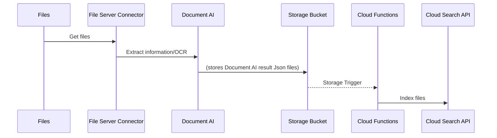

# Overview

This lab demonstrate how to create a simple .Net Core application to scane PDF files in a given local folder, send them to Document AI to extract information from these documents, and then index these documents in Cloud Search. So that users can then search these document in Cloud Search console.


# Flow Chart

> Install [Chrome Mermaid extension](https://chrome.google.com/webstore/detail/mermaid-diagrams/phfcghedmopjadpojhmmaffjmfiakfil) to have below flow chart properly showed

* [File Server Connector](./document-ai-processor/)

    1. Runs in your local machine to collect files placed in the folder you specified, send these files to a Storage Bucket for Document AI process, then
    2. Original file path will be stored in the Storage as part of its metadata
    3. Invoke Document AI batch process API to have Document AI extract information from these files
    4. Documnet AI batch processor will store result Json files to the Storage Bucket


* [Cloud Function Indexer](./function-indexer)

    1. Deployed as a Cloud Functions in GCP
    2. Triggered by Storage Trigger
    3. Handles File Created events in a given Bucket
    4. Collect result Json files and invoke Cloud Search's Index API to index these files




# Setup Environment

## Configure Cloud Search


* [MUST follow this introduction to setup Cloud Search](https://developers.google.com/cloud-search/docs/guides/project-setup)

* (Optional)[Configure Domain-Wide Delegation](https://admin.google.com/u/2/ac/owl/domainwidedelegation)

* Create an `appsettings.json` with below schema under source root

```json
{
    "fileSystem":{
        "folderPath":"<Filder Path of your files such as : /user/Documents/some-folder>",
        "searchSubFolders":"<true|false : placeholder only>"
    },
    "integration":{
        "DocumentAI":{
            "serviceAccountEmail":"<Service account email with access to Document AI API and GCS bucket>",
            "keyFile":"./secrets/docai-key.p12",
            "password":"notasecret",
            "gcs":"<GCS Bucket to store files : gs://some-bucket>",
            "gcs_project":"<GCP project Id>",
            "operation_url":"https://documentai.googleapis.com/v1beta3/projects/<Project Number>/locations/us/operations/",
            "small_ocr_url":"https://us-documentai.googleapis.com/v1beta3/projects/<Project Number>/locations/us/processors/<Processor ID>:process",
            "large_formParser_url": "https://us-documentai.googleapis.com/v1beta3/projects/<Project Number>/locations/us/processors/<Processor ID>:batchProcess"
        },
        "CloudSearch":
        {
            "serviceAccountEmail":"<Service account email with access to Cloud Search API and GCS bucket>",
            "keyFile":"./secrets/key.p12",
            "password":"notasecret",
            "url":"https://cloudsearch.googleapis.com/v1/indexing/datasources/<Data Source Id>/items",
            "datasource_id":"<Data Source Id>"
        }
    }
}
```

* Create Service Account and Download certificates to `secrets` folder


## Configure Document AI

* [Enable Document AI and Setup Service Account](https://cloud.google.com/document-ai/docs/setup)

* Create an `appsettings.json` with below schema under source root

```json
{
    "fileSystem":{
        "folderPath":"<Filder Path of your files such as : /user/Documents/some-folder>",
        "searchSubFolders":"<true|false : placeholder only>"
    },
    "integration":{
        "DocumentAI":{
            "serviceAccountEmail":"<Service account email with access to Document AI API and GCS bucket>",
            "keyFile":"./secrets/docai-key.p12",
            "password":"notasecret",
            "gcs":"<GCS Bucket to store files : gs://some-bucket>",
            "gcs_project":"<GCP project Id>",
            "operation_url":"https://documentai.googleapis.com/v1beta3/projects/<Project Number>/locations/us/operations/",
            "small_ocr_url":"https://us-documentai.googleapis.com/v1beta3/projects/<Project Number>/locations/us/processors/<Processor ID>:process",
            "large_formParser_url": "https://us-documentai.googleapis.com/v1beta3/projects/<Project Number>/locations/us/processors/<Processor ID>:batchProcess"
        },
        "CloudSearch":
        {
            "serviceAccountEmail":"<Service account email with access to Cloud Search API and GCS bucket>",
            "keyFile":"./secrets/key.p12",
            "password":"notasecret",
            "url":"https://cloudsearch.googleapis.com/v1/indexing/datasources/<Data Source Id>/items",
            "datasource_id":"<Data Source Id>"
        }
    }
}
```

## Deploy Cloud Functions

* Deploy Cloud Functions by zip the folder and upload to Cloud Functions.

* Create a Storage Trigger that monitors Storage Create/Finalize events and pointing to the Storage Bucket you specified in above `appsettings.json`


# Limitation

* At this moment (Jan 2021), Cloud Search default console does not allow open up links of `ftp://` or `file://`. If you need to index such files, you'll need a workaround like having another web page to open these link for you.

[Cloud Search Limitation](https://developers.google.com/cloud-search/docs/reference/limits)

[Document AI Limitation](https://cloud.google.com/document-ai/quotas)